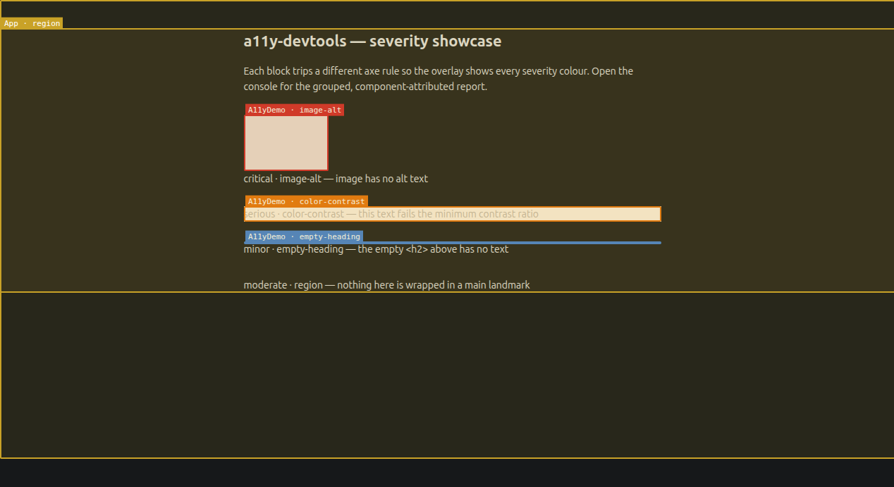
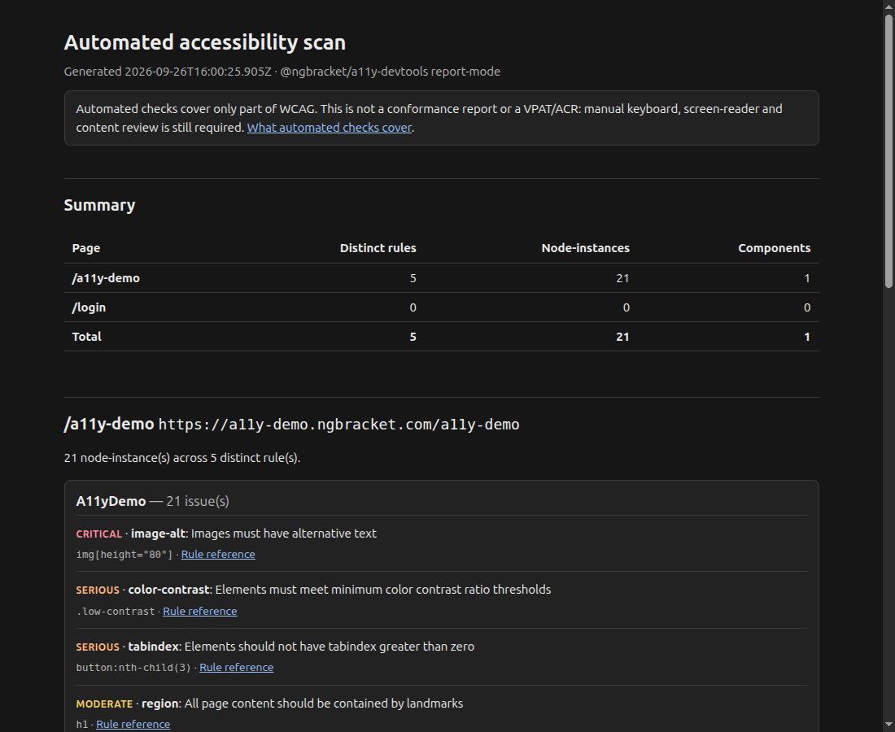

# Demos

Three ways to see `@ngbracket/a11y-devtools` working.

## 1. Standalone overlay (no Angular app needed)

`index.html` feeds the overlay hand-made findings so you can see the *rendering*
— severity-coloured boxes, component-labelled chips, click-to-scroll — on a plain
page. The compiled `dist/overlay.js` is framework-agnostic, so no build tooling is
involved beyond `tsc`.

```bash
npm run build
python3 -m http.server 8791   # then open http://localhost:8791/demo/index.html
```


## 2. End-to-end in a real Angular app

Wired into the Helm admin console (Angular 22, zoneless) with a single dev-only
provider:

```ts
// app.config.ts
providers: [
  // ...
  ...(isDevMode() ? [provideA11yDevtools({ log: true, overlay: true })] : []),
];
```

On the live `/login` page the tool runs a real axe scan, attributes every
violation to its owning component, and overlays them — nine `region`/`landmark`
findings, each labelled (`Login`, `NgbrPasswordField`, `NgbrLoginForm`,
`NgbrAuthField`, `NgbrAuthDivider`):


This exercises the whole pipeline together: dynamic axe scan → `window.ng`
component attribution → grouped console reporter → overlay → zoneless-aware
rescan, all behind the dev-only provider (tree-shaken out of production).

### All four severity colours

The admin app also ships a **dev-only** `/a11y-demo` route (registered only under
`isDevMode()`, so it never reaches production) that trips one axe rule per impact
level. It's the quickest way to see the overlay's full palette — critical (red),
serious (orange), moderate (yellow), minor (blue) — and the matching grouped
console report:



The grouped, component-attributed console report the overlay writes alongside it —
one summary line, then findings grouped by the component that rendered each:


Run it across a real app, fix what it surfaces, and the report goes quiet — here's
the admin `/login` page after clearing every violation the tool found there:


## 3. Report mode (headless, many routes)

The same scan run from the CLI across a list of routes, here against the public
demo at `https://a11y-demo.ngbracket.com`:

```bash
npx ngbr-a11y-report --base https://a11y-demo.ngbracket.com \
  --route /a11y-demo --route /login --format html --out a11y
```

The self-contained HTML report opens with a summary per page, then groups each
page's findings by the component that rendered them:



Every report (Markdown, JSON and HTML) states its scope up front: automated
checks cover only part of WCAG, so it is not a conformance report or a VPAT/ACR,
and manual keyboard, screen-reader and content review is still required:


## Local-link caveat (integrators)

When **linking this package into an app locally** (not installing a published
version), give it a real directory under the app's `node_modules` containing only
`dist/` + `axe-core` — **not a plain symlink to the source checkout**. A symlink
drags in the package's own `@angular/core`/`rxjs`, so the app ends up with *two*
Angular instances; the `ENVIRONMENT_INITIALIZER` the provider registers then
belongs to the wrong instance and is silently ignored (no overlay, no scan). A
normal published `npm install` resolves those peers to the consumer's single copy
and avoids this entirely.
