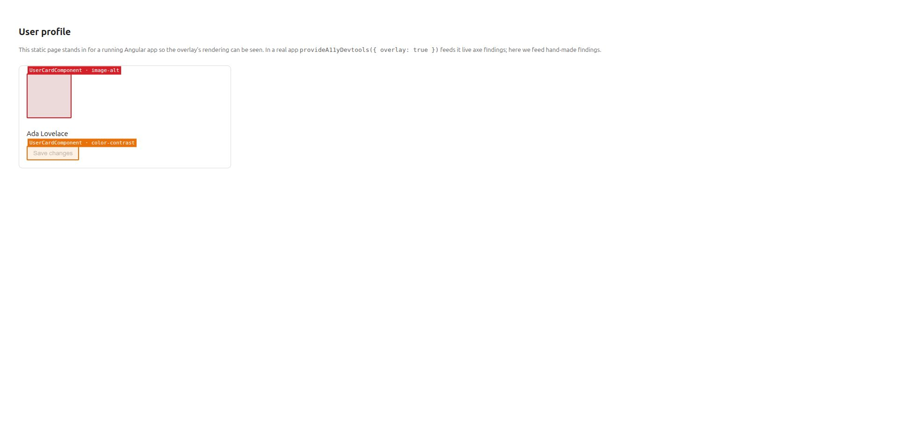
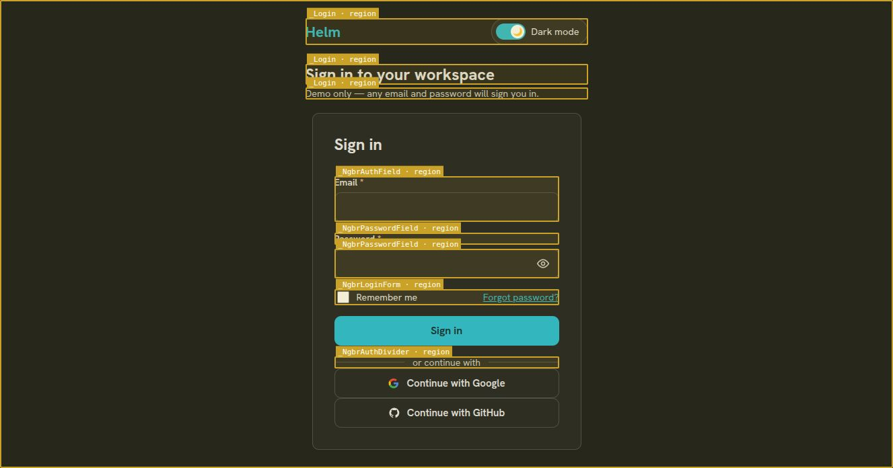
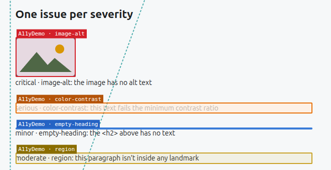
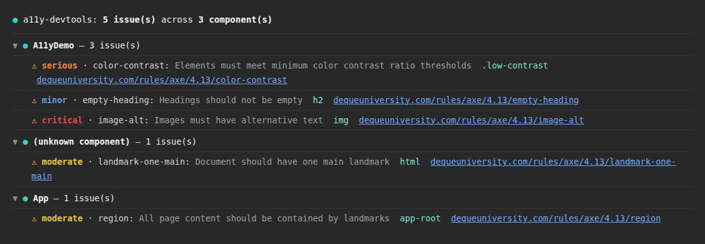
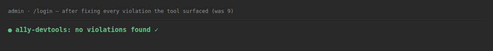
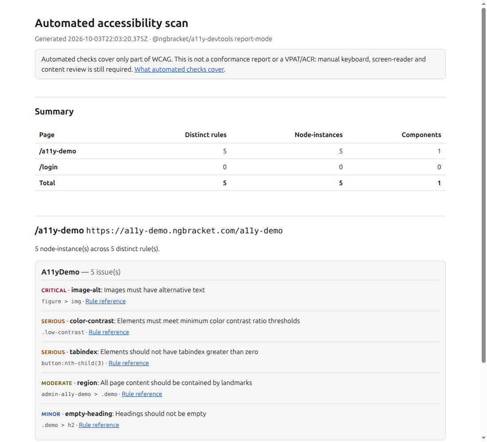
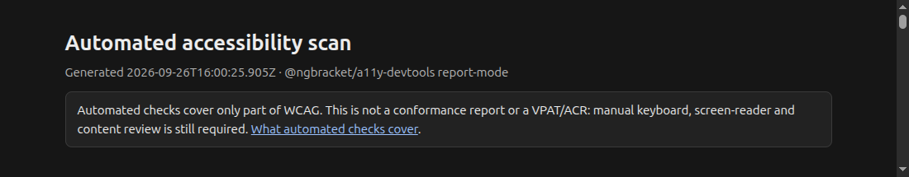

# Demos

Three ways to see `@ngbracket/a11y-devtools` working.

## 1. Standalone overlay (no Angular app needed)

`index.html` feeds the overlay hand-made findings on a plain page, so you can see how
it draws them: severity-coloured boxes, chips labelled with the component, and
click-to-scroll. The compiled `dist/overlay.js` doesn't depend on Angular, so the
only build step is `tsc`.

```bash
npm run build
python3 -m http.server 8791   # then open http://localhost:8791/demo/index.html
```



## 2. End-to-end in a real Angular app

Wired into the Helm admin console (Angular 22, zoneless) with a single dev-only
provider:

```ts
// app.config.ts
providers: [
  // ...
  ...(isDevMode() ? [provideA11yDevtools({ log: true, overlay: true })] : []),
];
```

On the `/login` page the tool runs an axe scan, finds the component that owns each
violation, and draws them on the page. Here that's nine `region` and `landmark`
findings, labelled `Login`, `NgbrPasswordField`, `NgbrLoginForm`, `NgbrAuthField`
and `NgbrAuthDivider`:



That one page uses every stage: the axe scan, component attribution through
`window.ng`, the grouped console report, the overlay, and rescanning in a zoneless
app. All of it sits behind the dev-only provider, which is tree-shaken out of
production builds.

### All four severity colours

The admin app also has an `/a11y-demo` route, registered only under `isDevMode()`,
that fails at least one axe rule at each impact level, so you can see all four overlay
colours: critical (red), serious (orange), moderate (yellow) and minor (blue).



The console report has one summary line, then the findings grouped by the
component that rendered each one. This capture is from September 2026, before the
demo page was put in landmarks, so its findings differ from the report below:



After we fixed the violations it found on the admin `/login` page, the report for
that page is empty:



## 3. Report mode (headless, many routes)

The same scan run from the CLI across a list of routes, here against the public
demo at `https://a11y-demo.ngbracket.com`:

```bash
npx ngbr-a11y-report --base https://a11y-demo.ngbracket.com \
  --route /a11y-demo --route /login --format html --out a11y
```

The self-contained HTML report opens with a summary per page, then groups each
page's findings by the component that rendered them:



Every report (Markdown, JSON and HTML) states its scope up front: automated
checks cover only part of WCAG, so it is not a conformance report or a VPAT/ACR,
and manual keyboard, screen-reader and content review is still required:



## Local-link caveat (integrators)

To link this package into an app locally instead of installing a published version,
create a real directory under the app's `node_modules` that contains only `dist/` and
`axe-core`. Don't symlink the source checkout. A symlink brings in the package's own
`@angular/core` and `rxjs`, so the app has two copies of Angular. The provider's
`ENVIRONMENT_INITIALIZER` then registers with the wrong copy and never runs, so you
get no overlay and no scan. A normal `npm install` of a published version uses the
app's own copy of those peers, so it doesn't have this problem.
